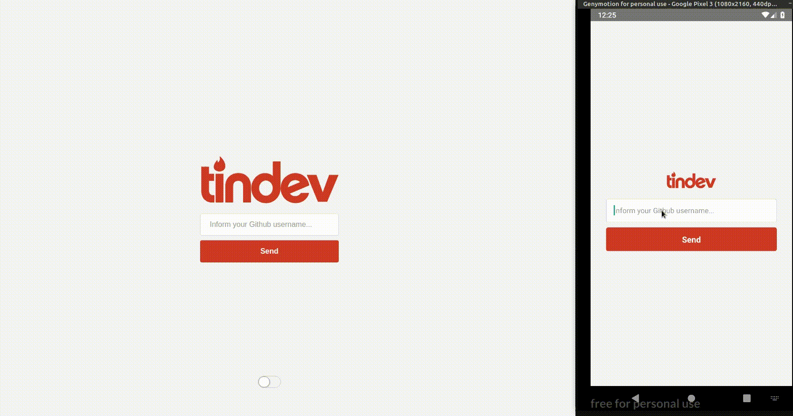

<h1 align="center">
    
</h1>

<h3 align="center">Match to other Github developers with interests in common - all in real time!</h3>

<section align="center">
  <h4>Stack</h4>
  <div>
    
    <span>Node</span>
  </div>
  <div>
    
    <span>React</span>
  </div>
  <div>
    
    <span>React Native</span>
  </div>
<section>

---

### :information_source: How To Use

#### Server

###### :exclamation: A running MongoDB is pre-requisite, unless you use docker-compose, which is already embeded.

```bash

$ cd backend

# set required environment variables
$ echo 'DB_HOST=tindev-db-container' >> .env
$ echo 'DB_PORT=27017' >> .env
$ echo 'DB_NAME=admin' >> .env
$ echo 'APP_PORT=3333' >> .env

# install dependencies
$ npm install

# Run server
$ npm start
```

##### ...or run it with Docker :whale:

```bash
$ cd backend

$ docker-compose up --build -d && docker logs --follow tindev-api-container
```

#### Web

```bash

$ cd frontend

# install dependencies
$ yarn

# Run application
$ yarn start
```

#### Mobile

```bash

$ cd mobile

# install dependencies
$ yarn

# Run application in Android
$ npx react-native run-android

# Run application in iOS
$ npx react-native run-ios
```

###### Check within `.env` files under `mobile` and `frontend` whether the API address is correct.

## Demo


